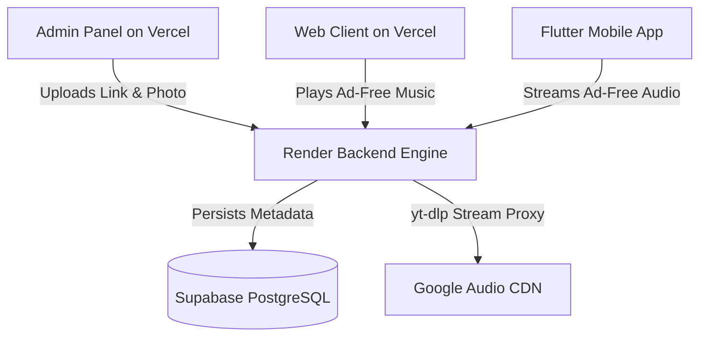

# 🚀 Complete Deployment Guide: SoundVault 2077

This guide walks you through deploying the **Backend Engine on Render**, **Web & Admin Portal on Vercel**, **Database on Supabase**, and **Mobile App on Android/iOS**.

---

## 🏗️ Architecture Overview



---

## Step 1: Database Setup on Supabase

1. Go to [https://supabase.com](https://supabase.com) and create a **New Project**.
2. Open the **SQL Editor** in your Supabase Dashboard.
3. Open [`schema.sql`](file:///d:/Project%202077/YT%20music/schema.sql) from this repository, copy the contents, paste into the SQL Editor, and click **Run**.
4. Navigate to **Project Settings -> API**:
   - Copy `Project URL` (e.g., `https://your-project.supabase.co`)
   - Copy `anon` `public` key

---

## Step 2: Deploy Backend Streaming Engine on Render

The backend is pre-configured with a **Dockerfile** containing Node.js 20, Python 3, and `yt-dlp` for 100% ad-free streaming.

### Method A: 1-Click Render Blueprint (Recommended)
1. Push your repository to **GitHub**.
2. Go to [https://render.com](https://render.com) -> **New** -> **Blueprint**.
3. Connect your GitHub repository.
4. Render will automatically detect [`render.yaml`](file:///d:/Project%202077/YT%20music/render.yaml) and build the Docker container.
5. Set the Environment Variables:
   - `PORT`: `5000`
   - `SUPABASE_URL`: (Your Supabase URL from Step 1)
   - `SUPABASE_ANON_KEY`: (Your Supabase Anon Key from Step 1)
6. Click **Apply**. Your streaming server will be live at:
   `https://soundvault-music-engine.onrender.com`

### Method B: Manual Render Web Service
1. In Render Dashboard, click **New -> Web Service**.
2. Select **Docker** environment.
3. Dockerfile path: `./backend/Dockerfile`
4. Docker context: `./backend`
5. Expose port `5000`.

---

## Step 3: Deploy Web App & Admin Panel on Vercel

1. Go to [https://vercel.com](https://vercel.com) and click **Add New -> Project**.
2. Import your GitHub repository.
3. In **Build and Output Settings**:
   - Framework Preset: `Other`
   - Root Directory: `./` (or leave default)
4. Add Environment Variable:
   - `ENV_API_URL`: `https://soundvault-music-engine.onrender.com/api` (Your Render URL)
5. Click **Deploy**.
6. Vercel will host your portals:
   - **Web App**: `https://your-app.vercel.app/web`
   - **Admin Portal**: `https://your-app.vercel.app/admin`

---

## Step 4: Build & Release Flutter Mobile App

The Flutter mobile app connects directly to your deployed Render streaming backend and supports offline phone storage download.

### 1. Point to Production Server
In [`dart_app/lib/services/api_service.dart`](file:///d:/Project%202077/YT%20music/dart_app/lib/services/api_service.dart), update the `baseUrl`:
```dart
static String baseUrl = 'https://soundvault-music-engine.onrender.com/api';
```

### 2. Build Android APK
Run the following commands inside `dart_app/`:
```bash
flutter pub get
flutter build apk --release
```
Your release APK will be generated at:
`dart_app/build/app/outputs/flutter-apk/app-release.apk`

### 3. Build iOS App
```bash
flutter build ios --release
```

---

## ⚡ Local Production Test

To run the complete production server locally at any time:
```bash
cd backend
npm start
```
* **Admin Dashboard**: [http://localhost:5000/admin](http://localhost:5000/admin)
* **Web Music App**: [http://localhost:5000/web](http://localhost:5000/web)
* **Health Check**: [http://localhost:5000/api/health](http://localhost:5000/api/health)
